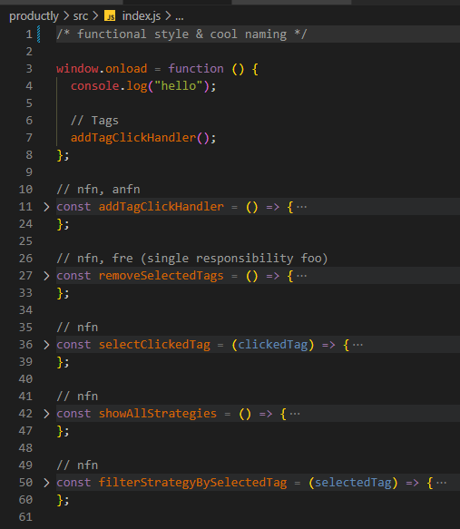

## productly

### feature

- sass

  - 7 in 1 pattern (https://sass-guidelin.es/ru/#section-36)
  - bem (logically and functionally independent blocks)
  - mixins (@include)
  - placeholders (@extend)
  - normalize/reset
  - variable/local variable (/about-us.scss)

- <ins>adaptive</ins> ([wha?](https://www.google.com/search?q=adaptive+vs+responsive)) layout resolutions

  - 1440px
  - 768px
  - 414px
  - 320px

- js pure

  - OOP & functional style

    

  - modal generator w modules

  ```js
  // watchers
  npm run style
  npx webpack --watch
  ```

- temp-source(D:\learn\temp\productly)

### install

- https://sass-lang.com/install

```js
npm install -g sass
// or
npm install --save-dev sass
// or
npm i sass
```

- part1 (https://www.youtube.com/watch?v=ZAde-IJAHzo)
- part2 (https://www.youtube.com/watch?v=BJENQIX2e2o)
- part3 (https://www.youtube.com/live/fooyYgIuZe8)
- part4 (https://www.youtube.com/live/Qk2UGlFNKPE)
- part5 (https://www.youtube.com/live/ouZnGUefneQ)
